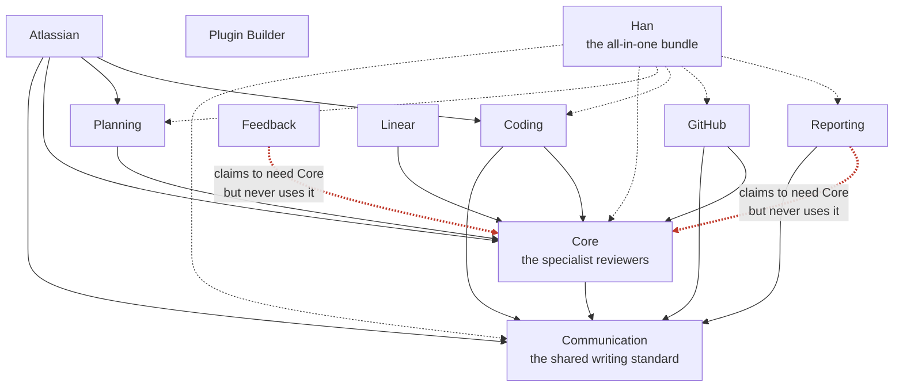

# Cleaning up Han: what to change, and what to leave alone

> Local copy of the source artifact for the han-publishing-cleanup build phase outline.
> Original: <https://claude.ai/code/artifact/1dfdb467-8593-4675-96b1-3e541a1f3b77> ("han-cleanup-plan.md").
> Captured 2026-07-21. The build phase outline cites the section headings below.

## The short version

Han's dependency structure is in better shape than it looks, and needs almost no cleanup. The real mess is somewhere
else entirely: in how Han gets published to the people who install it.

That is the surprise in this plan. I went looking for a tangled dependency graph to straighten out. What I found was a
graph with exactly two loose threads, sitting next to a publishing pipeline that has been quietly broken for months.

Every suggestion below was checked twice. First by the analysis that found it, then by a separate reviewer whose only
job was to prove each one wrong. That second pass killed two of my original suggestions outright and forced me to
rewrite three more. What is left is what survived being attacked.

---

## The dependency graph: two threads to snip

### Before

Each arrow is one plugin saying "I need this other plugin installed." Red arrows are the two that are not true.

Two plugins declare that they need the Core plugin, and then never touch it. Both are leftovers. Reporting used to
reach into Core for its writing pass, that capability moved to the Communication plugin, the code was updated, and
nobody removed the old line. Feedback's case is even clearer: it is not permitted to call other plugins at all, so its
claim cannot possibly be true.

The cost is not dramatic. Anyone installing either plugin quietly gets a large plugin they will never use. The real
damage is to trust: once two of these declarations are decorative, nobody can rely on any of them to answer "what
actually breaks if I change this?"

### After

That is the entire dependency cleanup. Two lines deleted. Nothing added.

I want to be honest about how small that is, because I expected a bigger answer and went looking for one. The graph has
no loops. Every arrow points the right way, from the plugins that use things toward the plugins that provide them. The
foundation sits at the bottom exactly where it was designed to sit. This part of the system was built carefully and it
held up.

### Two changes I proposed and then withdrew

I originally wanted to add arrows, not just remove them.

**Wiring Planning into the writing standard.** Planning produces more prose than any other plugin, and it is the only
one not connected to the shared writing standard. That looked like an obvious oversight. It is not. The team already
considered exactly this, wrote down the reasoning, listed it explicitly as out of scope, had it challenged during a
plan review, and confirmed the exclusion anyway. I was about to reopen a settled decision and present it as a bug. If
the team wants to revisit it, that is a fresh decision to make on purpose, not a gap to patch.

**Declaring the hidden contract between Planning and the three ticket publishers.** Three plugins read a file that
Planning writes, and only one of them admits it. My instinct was to make them all declare it. The reviewer pointed out
this would backfire: declaring a dependency in this system does not annotate a relationship, it forces an install.
Every GitHub user would be made to install all of Planning to document a connection that no code actually follows.
Worse, it is the same move the team already rejected for good reasons elsewhere. The relationship is real and worth
writing down. It belongs in the documentation, not in the install instructions.

---

## The publishing pipeline: the actual problem

Han ships to two different places. One of them has been slowly rotting, and the process that would notice is
structurally incapable of seeing it.

### Before

Three things are going wrong here at once, and they share one root cause.

**The release process only knows about half the world.** It updates two places. There are four. It does not read the
other two, which means it cannot even detect that they have fallen behind. This is why roughly twenty releases went by
without anyone catching it. No amount of care during a release would have surfaced the problem, because the problem is
invisible from inside the release.

**People on the second channel are stuck on old versions and cannot tell.** That channel decides whether an update is
available by reading a version number that has not moved since the day it was written. So it never offers anyone an
update. They are running old skills and have no way to know.

**One plugin is not there at all.** The Linear integration exists, works, and is advertised in the setup instructions
for that channel. It was never actually published there. Someone following the documented instructions gets an error.
That is a broken promise in the first thing a new user tries.

The Linear gap is the tell. It was added two days before the pass that would have published it, and that pass simply
missed it. Which means this is not a one-time slip. Any plugin added today lands invisible on that channel by default.

### After

The release starts by looking at what is actually in the repository rather than trusting a list that can go stale. It
checks that every plugin appears everywhere it is supposed to. If something is missing, it stops and says so instead of
shipping around the gap. And it updates all four places rather than two.

One deliberate exception stays: the all-in-one bundle genuinely cannot be published to the second channel, because that
channel does not support bundles yet. That is a real limitation, it is documented, and the check needs to know about it
permanently rather than flagging it forever.

### The order matters, and getting it wrong stops everything

This is the part I got wrong first, and the reviewer caught it.

If the automated check lands before the underlying problems are fixed, it fails immediately, on almost every plugin,
and blocks every release and every pull request from day one. The check is correct. The tree is not ready for it.

So: fix the Linear gap, correct the stale version numbers, and teach the check about the bundle exception. Then turn
the check on. In that order, the check lands green and stays green. In the other order, it lands red and someone turns
it off, and then it protects nothing.

---

## The shared ticket file: a real bug, described more carefully than I first described it

Three plugins publish work items to three different trackers, and they all mark up the same shared file to record what
they published. Two of them mark it up in a way that is indistinguishable from each other.

Publish to one tracker, then feed the same file to the other, and the second one sees the first one's marks, concludes
the work is already published, and skips it.

I originally called this silent. The reviewer pushed back, and was right. Both of those plugins do report a count of
what they skipped, twice. A person paying attention would notice. It is a trap, not a disappearance.

But the reviewer also found something worse that I had not. The third plugin, the GitHub one, has a genuine hole. If it
meets a file marked up by a different tracker, the marks match none of the patterns it looks for. The work items do not
get published, and they do not show up in the skipped count either. They simply vanish from the run, with no error and
no signal. That one really is silent, and it is the one worth fixing first.

The fix is to make each plugin's marks say which tracker they came from, so no plugin can mistake another's marks for
its own. It is a format change, so files already marked up the old way need a migration path. There is one, and it errs
toward stopping and asking rather than guessing.

---

## Things that are fine, that I checked anyway

Worth stating plainly, because "we looked and it was fine" is a real result:

- **The dependency graph has no loops and points the right way.** It matches its own documentation exactly.
- **No two skills or reviewers anywhere in the system have colliding names.** Not one, across eleven plugins.
- **Every plugin that talks to an outside service checks that the service is reachable before doing any work.** All six
  of them, consistently, before spending any of your time.
- **The feedback plugin's error handling is the best in the codebase.** It specifically prevents a retry from creating
  a duplicate.
- **Nobody built machinery they did not need.** A reviewer went looking specifically for over-engineering and found
  none. The versioning documentation was singled out as a model of restraint: it names the tooling the project
  deliberately does not use and the exact circumstance that would justify revisiting.

---

## Two places the reviewer changed my mind entirely

These matter because they reverse conclusions from the earlier analysis, and I would rather flag that than quietly ship
the old answer.

**On duplicated rule files.** Three plugins each carry their own copy of the same two rule documents. The earlier
analysis said: leave them alone, they have never actually drifted apart, and consolidating them is more disruption than
it prevents. The reviewer checked the history properly and found that one of those rules _was_ edited, meaningfully,
and somebody had to remember to make the identical change in three separate places to keep them aligned. That is not
evidence that consolidation is unnecessary. That is evidence that a human is currently doing the job by hand and
getting it right so far. It strengthens the case for consolidating rather than weakening it.

**On version compatibility between plugins.** The earlier analysis argued that plugins never need to declare which
versions of each other they work with, because everything ships together from a single snapshot. The reviewer checked
how installation actually works and refuted it. Plugins are installed and updated one at a time. Someone can update the
Core plugin today while running a Coding plugin from months ago, and nothing anywhere would notice or complain. The
single-snapshot argument only holds for a fresh install of everything at once, which is not how the system is used over
time. I am not proposing a fix here, because the right fix is not obvious and this deserves a real decision. But the
question is open, and the earlier analysis closed it too early.

---

## What I would do, in order

1. **Publish the Linear plugin to the second channel.** It is advertised, it is missing, and someone following the
   instructions hits an error today.
2. **Fix the GitHub publisher's hole**, where work items marked up by another tracker disappear from a run with no
   trace.
3. **Correct the frozen version numbers**, so people on the second channel start being offered updates again.
4. **Delete the two dependency lines that are not true.**
5. **Fix the two documents that describe a behavior the system does not have**, so nobody makes a change based on them
   and gets it wrong.
6. **Teach the release process about all four places**, and to start from what is really in the repository.
7. **Only now, turn on the automated check.** It will be green, and it will stay green, and it will make every problem
   above impossible to reintroduce.

The first six are small. Most are a few lines. The seventh is what makes them stay fixed, and it is why the order is
not negotiable: turn the check on first and it fails on everything, someone disables it, and you are back where you
started with an extra broken thing.

---

## How much of this to trust

Every claim here was verified against the actual files rather than inherited from the earlier analysis. That mattered:
a meaningful fraction did not survive. Two proposed fixes were withdrawn, three descriptions were corrected, and two
earlier conclusions were reversed. The reviewer's own confidence rating was medium, and the things it could not check
are worth naming.

It could not test whether the format-checking step that is supposed to catch a mismatched ticket file actually catches
one in practice, because that depends on judgment at the time rather than anything written down. It could not measure
the impact of the format change on files already sitting in people's repositories, because none exist here to check.
And its conclusion about version compatibility rests on the project's own description of how installation works being
accurate to the real thing.

Those are honest gaps, not hedging. Everything else in this plan was checked against the files, and the parts that
could not survive that are not in it.
