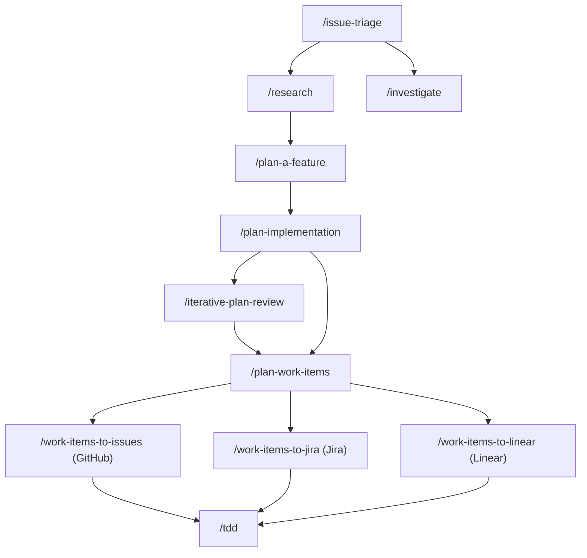
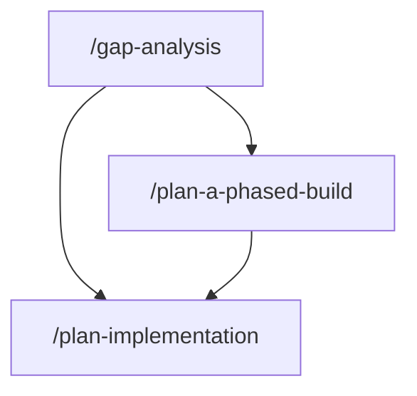
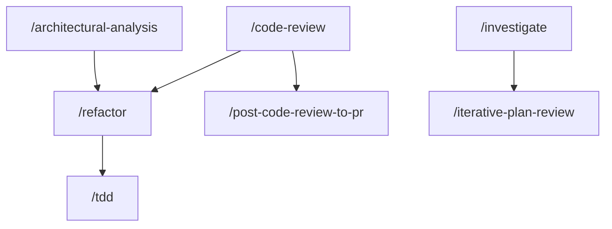

# Workflows

This page is the map of which Han skills chain together. Most real work runs several skills in sequence, where one
skill's output becomes the next one's input. This page shows the common chains, with a flow diagram wherever a chain
branches enough that a picture beats the prose.

It is one of four navigation surfaces, and each has a distinct job:

- **This page (Workflows)** is the map of which skills chain together.
- **[Quickstart](./quickstart.md)** gives you do-this-now paths for five common situations.
- **[How-to guides](./how-to/README.md)** walk a single task end to end, step by step.
- **[Concepts](./concepts.md)** explains the skill-and-agent model the whole suite is built on.

If you know the task but not the sequence, you are in the right place. If you want the model behind the skills, read
Concepts first.

## From a problem to a shipped change

The planning skills feed the coding and delivery skills. This is the longest chain in the suite, and it branches at
several points depending on what you already know and where the work is tracked.

- **[`/issue-triage`](../han-core/docs/skills/issue-triage.md) → [`/investigate`](../han-coding/docs/skills/investigate.md).**
  When a report is vague, triage it first, then investigate the root cause.
- **[`/issue-triage`](../han-core/docs/skills/issue-triage.md) →
  [`/research`](../han-core/docs/skills/research.md) → [`/plan-a-feature`](../han-planning/docs/skills/plan-a-feature.md).**
  When triage finds a problem-space unknown, research the options first, then specify the chosen one.
- **[`/plan-a-feature`](../han-planning/docs/skills/plan-a-feature.md) →
  [`/plan-implementation`](../han-planning/docs/skills/plan-implementation.md) →
  [`/iterative-plan-review`](../han-planning/docs/skills/iterative-plan-review.md) →
  [`/plan-work-items`](../han-planning/docs/skills/plan-work-items.md).** Specify, plan the build, stress-test the plan,
  then break it into work. Skip the review pass when the plan is already trusted.
- **[`/plan-work-items`](../han-planning/docs/skills/plan-work-items.md) → publish.** Turn the work items into tickets
  where your team tracks them: [`/work-items-to-issues`](../han-github/docs/skills/work-items-to-issues.md) for GitHub,
  [`/work-items-to-jira`](../han-atlassian/docs/skills/work-items-to-jira.md) for Jira (opt-in `han-atlassian`), or
  [`/work-items-to-linear`](../han-linear/docs/skills/work-items-to-linear.md) for Linear (opt-in `han-linear`).

## From a gap to a plan

When you have two artifacts to compare (a spec against an implementation, a PRD against a shipped feature), start from
the gap report and route its findings into planning.

- **[`/gap-analysis`](../han-core/docs/skills/gap-analysis.md) →
  [`/plan-implementation`](../han-planning/docs/skills/plan-implementation.md).** The gap report's `G-NNN` IDs become
  work in the implementation plan.
- **[`/gap-analysis`](../han-core/docs/skills/gap-analysis.md) →
  [`/plan-a-phased-build`](../han-planning/docs/skills/plan-a-phased-build.md) →
  [`/plan-implementation`](../han-planning/docs/skills/plan-implementation.md).** Order the `G-NNN` IDs into vertical
  slices first, then give each greenlit phase its own implementation plan.

## Working in code

The review, refactor, and build skills chain in both directions: a review can feed a refactor, and a refactor can
prepare the ground for a test-first build.

- **[`/code-review`](../han-coding/docs/skills/code-review.md) →
  [`/post-code-review-to-pr`](../han-github/docs/skills/post-code-review-to-pr.md).** Review locally, then post the
  review to the PR.
- **[`/code-review`](../han-coding/docs/skills/code-review.md) or
  [`/architectural-analysis`](../han-coding/docs/skills/architectural-analysis.md) →
  [`/refactor`](../han-coding/docs/skills/refactor.md).** The review's structural findings become the refactoring plan's
  work orders.
- **[`/refactor`](../han-coding/docs/skills/refactor.md) → [`/tdd`](../han-coding/docs/skills/tdd.md).** Preparatory
  refactoring makes the change easy, then `/tdd` makes the easy change.
- **[`/investigate`](../han-coding/docs/skills/investigate.md) →
  [`/iterative-plan-review`](../han-planning/docs/skills/iterative-plan-review.md).** Root-cause the bug, then stress-test
  the proposed fix.

## Understanding and documenting a codebase

These chains are linear, so they need no diagram.

- **[`/project-discovery`](../han-core/docs/skills/project-discovery.md) →
  [`/project-documentation`](../han-core/docs/skills/project-documentation.md) →
  [`/coding-standard`](../han-coding/docs/skills/coding-standard.md).** Discover the project, document it, then capture
  its conventions as standards.
- **[`/code-overview`](../han-coding/docs/skills/code-overview.md) →
  [`/code-review`](../han-coding/docs/skills/code-review.md).** Get oriented in unfamiliar code or a PR first, then judge
  whether it is any good.

## Related documentation

- [Repo root](../README.md). The Han suite landing page.
- [Skills index](./skills/README.md). Every skill, with a scent line and a link to its long-form doc.
- [Agents index](./agents/README.md). Every agent the skills dispatch.
- [Plugin index](./choosing-a-han-plugin.md). Every plugin and which one to install.
- [Quickstart](./quickstart.md), [How-to guides](./how-to/README.md), [Concepts](./concepts.md). The other three
  navigation surfaces.
