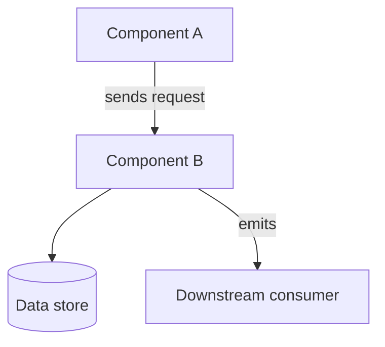
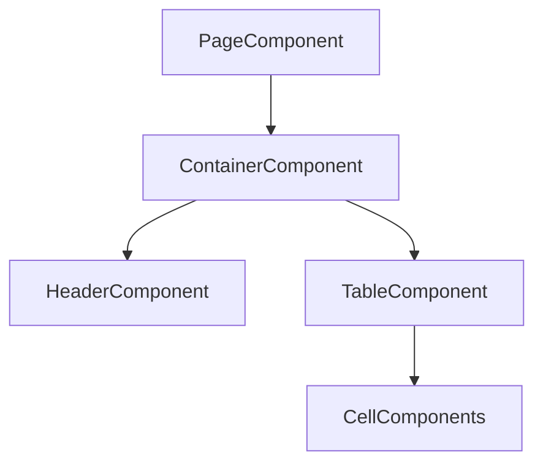

# {Feature Name}

<!-- One-sentence description: what this feature/system does and why it exists. -->

- **Last Updated:** {YYYY-MM-DD HH:mm}

## Summary

<!-- Lead with plain language. Write 2-4 short sentences for a reader who has not seen -->
<!-- the code: what this feature is for, who uses it, what problem it solves, and what it -->
<!-- produces. No code, no type names, no file paths here. This is the paragraph someone -->
<!-- reads to decide whether they are in the right place. -->

{Plain-language summary paragraph.}

<!-- Then the most important facts a reader needs to orient, as scannable bullets. -->

- ...
- ...

Key files:
<!-- The 3-5 files a reader would open first. The full table lives in Key Files below. -->
- `path/to/primary-file` - Brief purpose
- `path/to/secondary-file` - Brief purpose

## Architecture

<!-- Mermaid diagram showing the feature's high-level structure: the main parts and how -->
<!-- they connect. Use a `flowchart` (TD for layered structure, LR for a pipeline). Label -->
<!-- each node with a part a reader would recognize, and label the edges with what passes -->
<!-- between them. This shows what the parts are; How It Works and Primary Flows below -->
<!-- explain what they do. Keep it to the parts that matter — a reader should grasp the -->
<!-- shape at a glance, not trace every wire. -->



## How It Works

<!-- Plain-language explanation of how the feature behaves. 2-4 short paragraphs. No code. -->
<!-- Name the main moving parts in everyday terms and describe what each one does and how -->
<!-- they work together. Set up the diagram above and the flows below. This is the spine -->
<!-- of the document: a reader who only needs to understand the feature can stop after -->
<!-- Primary Flows and never read the Technical Reference. -->

{Behavioral overview prose.}

## Primary Flows

<!-- Narrate the feature's main paths step by step, in functional terms. Cover the 1-3 -->
<!-- flows that matter, not every branch. Each flow gets an H3 named for what happens -->
<!-- (e.g. "Submitting an order", "Retrying a failed webhook"). Name the actor or trigger, -->
<!-- list the steps in plain language (what happens and why, not which function is called), -->
<!-- and state the outcome. Narrate the main failure path too, as steps. Reference a file -->
<!-- or type by name only when it aids understanding; the deep detail lives in Technical -->
<!-- Reference below. Add a small Mermaid diagram here if a flow needs one — a -->
<!-- `sequenceDiagram` for actor-to-system exchanges, or a `flowchart` for branching paths. -->

### {Flow name}

**Trigger:** {who or what starts this flow}

1. **{What happens}** — {plain-language explanation of this step}
2. **{What happens next}** — {explanation}
3. **{Outcome}** — {what the reader ends up with}

**When it fails:** {narrate the main failure path in plain steps, and what the reader sees.}

## Key Files

<!-- Organize by layer. Include the files relevant to understanding or modifying this feature. -->

### Backend
<!-- CONDITIONAL: Include only if the feature has backend files -->
| File | Purpose |
|------|---------|
| `path/to/file` | ... |

### Frontend
<!-- CONDITIONAL: Include only if the feature has UI components -->
| File | Purpose |
|------|---------|
| `path/to/file` | ... |

### Infrastructure
<!-- CONDITIONAL: Include only if there are deployment, CI/CD, or config files -->
| File | Purpose |
|------|---------|
| `path/to/file` | ... |

## Configuration

<!-- CONDITIONAL: Include when environment variables or config files change behavior. -->
<!-- This sits with the behavioral content because it changes what the feature does. -->
<!-- For cross-cutting features, split into Backend and Frontend sub-sections. For -->
<!-- single-layer features, skip the sub-headings. -->

### Backend
| Variable | Description | Default |
|----------|-------------|---------|
| `ENV_VAR_NAME` | What it controls | `default_value` |

### Frontend
| Variable | Description | Default |
|----------|-------------|---------|
| `ENV_VAR_NAME` | What it controls | `default_value` |

## Error Handling

<!-- CONDITIONAL: Include when there are specific error scenarios worth documenting. -->
<!-- This is the lookup table for failure behavior. The narrative failure path belongs -->
<!-- in the relevant Primary Flow above; this table is where a reader looks up a specific -->
<!-- scenario. For cross-cutting features, split into Backend and Frontend sub-sections. -->

### Backend
| Scenario | Error / HTTP Status | Behavior |
|----------|---------------------|----------|
| Description | `400 Bad Request` | What happens |

### Frontend
| Scenario | Error Handling | Behavior |
|----------|----------------|----------|
| Description | Error boundary / toast / fallback | What happens |

---

## Technical Reference

<!-- Everything below is lookup detail, not required reading. A reader who only needs to -->
<!-- understand what the feature does and how it behaves can stop above. Keep these -->
<!-- sections, but treat them as supporting detail under the behavioral spine, not as the -->
<!-- main body. Prefer short, illustrative snippets and file pointers over reproducing -->
<!-- long source. Skip any sub-section that does not apply. -->

### Data Model

<!-- CONDITIONAL: Include when the feature has its own tables or adds columns. -->
<!-- Lead with one plain sentence on what is stored and why. Keep the schema concise; it -->
<!-- is often the only written record of the data shape, so keep it, but trim to the -->
<!-- columns that matter and comment only the non-obvious ones. -->

{One sentence on what this stores and why.}

```sql
CREATE TABLE TableName (
    id int(11) NOT NULL AUTO_INCREMENT,
    -- ... columns that matter, with comments on the non-obvious ones
    PRIMARY KEY (id)
);
```

### Core Types

<!-- CONDITIONAL: Include when key interfaces, structs, or types define the contract. -->
<!-- Lead with one sentence on what these types represent. Show a short snippet of the -->
<!-- key fields, or point to the source file rather than reproducing the full definition. -->
<!-- For cross-cutting features, include Backend and Frontend sub-headings; otherwise use -->
<!-- only the relevant one. -->

{One sentence on what these types represent in the feature.}

See `path/to/types-file` for the full definitions. Key fields:

```{language}
// A short snippet of the most important fields, with brief annotations
```

### Constants

<!-- CONDITIONAL: Include when magic numbers, enum values, or named constants matter. -->
<!-- A table is the written record of these values; keep it. For cross-cutting features, -->
<!-- split into Backend and Frontend; otherwise skip the sub-headings. -->

| Constant | Value | Description |
|----------|-------|-------------|
| `ConstantName` | `42` | What it means |

### Implementation Notes

<!-- CONDITIONAL: Include when there is non-obvious logic worth calling out. -->
<!-- Reference-level detail. The behavioral spine lives in How It Works and Primary Flows -->
<!-- above; do not reproduce long source here. Point to the file and function, and include -->
<!-- a short snippet only where the source is non-obvious and a reader needs to see it. -->
<!-- Sub-head by operation or feature area. -->

#### {Operation or Feature Area}

{Plain-language note on the non-obvious part, with a pointer to `path/to/file`.}

```{language}
// Short snippet only if the source is non-obvious; otherwise omit and link to the file
```

### API Endpoints

<!-- CONDITIONAL: Include when the feature exposes API endpoints. -->
<!-- The endpoint table is the reference. Include request/response bodies only when the -->
<!-- shape is non-obvious; otherwise the table and a pointer to the schema suffice. -->

| Method | Path | Handler | Description |
|--------|------|---------|-------------|
| `GET` | `/v1/resource` | `ListResource` | List with pagination |
| `POST` | `/v1/resource` | `CreateResource` | Create new |

<!-- CONDITIONAL: Include a request/response example only for endpoints whose payload -->
<!-- shape is non-obvious. -->

**Request:**
```json
{
  "field": "value"
}
```

**Response:**
```json
{
  "data": { ... }
}
```

### Events

<!-- CONDITIONAL: Include when the feature emits or subscribes to events. -->

#### Emitted Events
| Event | Payload Type | When Emitted |
|-------|-------------|--------------|
| `domain.action` | `DomainActionPayload` | When ... |

#### Subscribed Events
| Event | Handler | Behavior |
|-------|---------|----------|
| `other.event` | `handleOtherEvent` | Does ... |

### Frontend Components

<!-- CONDITIONAL: Include when the feature has significant UI components. -->
<!-- Include only the sub-sections below that apply. Each sub-section is CONDITIONAL. -->
<!-- Prefer tables and the component tree over reproducing component source. -->

#### Component Hierarchy

<!-- CONDITIONAL: Include when there's a meaningful page/component tree to illustrate. -->
<!-- Use a Mermaid `flowchart TD` so the tree renders as nested boxes. -->



#### Routing

<!-- CONDITIONAL: Include when the feature defines its own routes or URL patterns. -->

| Route | Page Component | Description |
|-------|----------------|-------------|
| `/feature` | `FeaturePage` | Main listing |
| `/feature/:id` | `FeatureDetailsPage` | Detail view |

#### Custom Hooks

<!-- CONDITIONAL: Include when the feature has custom hooks beyond generated API hooks. -->

| Hook | Purpose | Key Params |
|------|---------|------------|
| `useFeatureState()` | Manages local feature state | `featureId` |

#### Context / Providers

<!-- CONDITIONAL: Include when the feature defines or consumes contexts or providers. -->

| Context | Provider | Purpose |
|---------|----------|---------|
| `FeatureContext` | `FeatureProvider` | Shares feature state across component tree |

#### State Management

<!-- CONDITIONAL: Include when the feature has notable state patterns (caching, stores, -->
<!-- reducers). Describe the pattern in a sentence and point to the source; include a -->
<!-- snippet only if the pattern is non-obvious. -->

{One sentence on the state pattern, with a pointer to `path/to/file`.}

#### Offline Support

<!-- CONDITIONAL: Include when the feature uses local storage, background sync, or -->
<!-- offline-first patterns. -->

| Component | Purpose |
|-----------|---------|
| `path/to/offline-service` | Local storage CRUD operations for offline cache |
| `path/to/sync-component` | Background sync when connectivity restored |

#### Event Patterns

<!-- CONDITIONAL: Include when the feature uses custom DOM events, editor events, or -->
<!-- window events. -->

| Event | Dispatched By | Handled By | Purpose |
|-------|---------------|------------|---------|
| `feature:updated` | `FeatureEditor` | `FeatureList` | Refresh list after inline edit |

### Adding a New {Item}

<!-- CONDITIONAL: Include when the feature has a repeatable extension pattern (new event -->
<!-- type, new endpoint, new column, etc.). -->

1. **Step one** — What to do and where
2. **Step two** — What to do and where
3. **Step three** — What to do and where

### Testing

<!-- CONDITIONAL: Include when there are notable test patterns, file locations, or -->
<!-- isolation requirements. For cross-cutting features, split into Backend and Frontend. -->

#### Backend
- `path/to/test_file` - What it tests

#### Frontend
- `path/to/test_file` - What it tests

#### Test Patterns
<!-- Describe any special setup, fixtures, or isolation needed, including patterns shared -->
<!-- across layers. -->

### Troubleshooting

<!-- CONDITIONAL: Include when there are known issues, common mistakes, or debugging tips. -->

#### {Problem Description}

1. Check ...
2. Verify ...
3. Try ...

## Related Documentation

<!-- Always include. Link to related docs and ADRs using relative links. -->

- [Related Doc](./related-doc.md) - How it relates
- [ADR-NNNN](./adr/NNNN-title.md) - Relevant architectural decision
